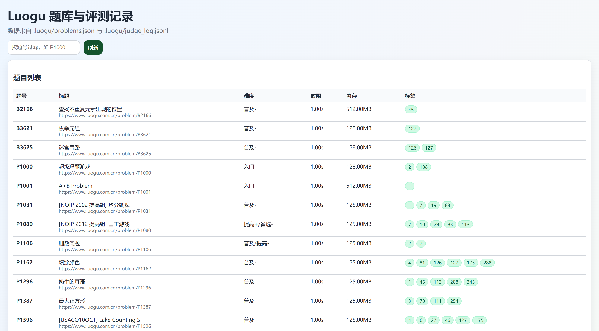

# Luogu 本地测评机（专注 C++）

这是一个专注于 C++ 题解开发与样例测评的 Luogu 本地评测工具。
核心能力：抓题、生成本地目录、编译 C++、运行样例、记录评测历史、网页查看结果。

## 快速开始

```bash
cargo build --release
./target/release/luogu fetch P1000
./target/release/luogu judge P1000
./target/release/luogu catalog --history
```

## 命令

### 获取题目

```bash
luogu fetch P1000
```

常用参数：
- `--base-dir problem`：题目根目录
- `--force`：覆盖已有目录中的生成文件

### C++ 样例测评

```bash
luogu judge P1000
```

常用参数：
- `--source main.cpp`：指定源文件（只支持 `.cpp/.cc/.cxx`）
- `--timeout 3`：单测超时秒数
- `--cflags`：额外编译参数（可重复）

示例：

```bash
# 默认使用配置文件中的编译参数
luogu judge P1000

# 指定源码文件
luogu judge P1000 --source solve.cpp

# 增加调试宏
luogu judge P1000 --cflags -DDEBUG --cflags -g
```

### 目录与历史

```bash
luogu catalog
luogu catalog --history
```

### 本地网页服务


```bash
luogu serve
```

默认地址：`http://127.0.0.1:8787/`

## C++ 编译配置文件

评测编译参数由项目根目录配置文件 `judge_cpp.json` 管理（不再通过 CLI 的 `--std/--opt` 修改）。

首次执行 `luogu judge` 时若不存在该文件，会自动生成默认配置：

```json
{
  "compiler": "g++",
  "cpp_standard": "c++17",
  "optimization": "O2",
  "extra_flags": []
}
```

字段说明：
- `compiler`：编译器命令，例如 `g++`
- `cpp_standard`：`c++11/c++14/c++17/c++20/c++23`
- `optimization`：`none/O1/O2/O3/Os`
- `extra_flags`：额外编译参数数组

## 数据目录

- `.luogu/problems.json`：题目元数据
- `.luogu/judge_log.jsonl`：评测历史
- `problem/PID/T.md`：题目描述
- `problem/PID/main.cpp`：默认代码模板
- `problem/PID/sampleN.in/out`：样例数据
