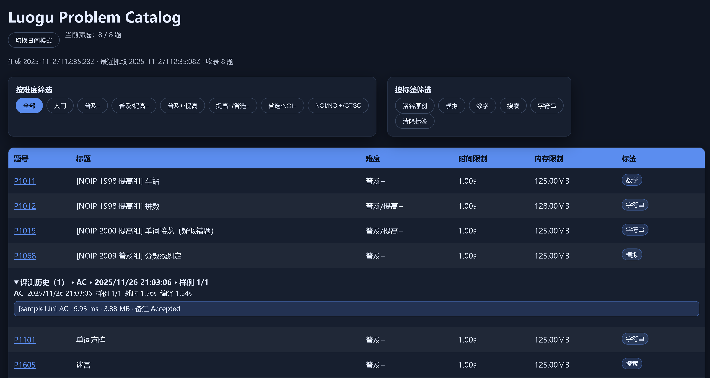

> this script is generate by gpt5-codex
# Luogu 练习工作区

## Rust CLI（推荐，全新界面）

项目已完全迁移到 Rust CLI，功能覆盖获取题目、本地评测、结果管理。

### 🚀 快速开始

#### 方式 1：全局安装（推荐）

```bash
# 一次性安装到系统
cargo install --path .

# 之后可直接使用（全局命令）
luogu fetch P1000
luogu judge P1000
luogu catalog --history
luogu serve
```

#### 方式 2：Makefile 快捷命令（项目目录）

```bash
# 帮助
make help

# 构建
make build

# 在项目目录中使用
make run-fetch P=P1000       # 等价于: luogu fetch P1000
make run-judge P=P1000       # 等价于: luogu judge P1000
make run-catalog             # 列出题目
make run-catalog-history     # 查看评测历史
target/release/luogu serve   # 启动网页服务
```

#### 方式 3：cargo run（最慢，仅调试）

```bash
cargo run -- fetch P1000
cargo run -- judge P1000
cargo run -- catalog --history
```

### 📋 命令详解

#### 获取题目

```bash
luogu fetch P1000
```

输出示例（彩色+结构化）：
```
✓ P1000 与幼儿园有关的数学题 [普及+/提高]
📁 /path/to/problem/P1000
📊 3 samples | 1000ms time | 32000KB memory
```

配置：
- `--base-dir problem`：题目保存目录（默认）
- `--force`：覆盖已有文件

#### 本地评测

```bash
luogu judge P1000
```

编译器自动编译 `main.cpp`，运行所有样例。输出简洁摘要：
```
⚙ Compiling with c++17 ...
✓ Compiled in 0.45s
▶ Running 3 samples ...

✓ P1000 - 3/3 AC - All tests passed!
```

当答案错误（WA）时，会额外输出和标准答案的差异，例如：
```
[sample1.in] WA
wrong answer
diff at line 1
expected: 50
actual:   -10
```

**配置选项：**
- `--language cpp/python`：编程语言（默认自动检测）
- `--source main.cpp`：源文件名（默认自动搜索 main.cpp/main.py）
- `--std c++11/14/17/20/23`：C++ 标准（默认 c++17）
- `--opt none/O1/O2/O3/Os`：优化级别（默认 O2）
- `--timeout 5.0`：单测超时秒数（默认 3）
- `--cflags`：额外编译参数（如 `-DDEBUG`）

**使用示例：**
```bash
# 默认：自动检测 main.cpp，c++17，-O2
luogu judge P1000

# 强制用 Python
luogu judge P1000 --language python

# C++20 + O3 优化
luogu judge P1000 --std c++20 --opt O3

# 关闭优化（调试）
luogu judge P1000 --opt none

# 自定义编译参数
luogu judge P1000 --cflags="-DDEBUG" --cflags="-g"
```

#### 查看题目和历史

```bash
# 列出已下载题目
luogu catalog

# 输出表格示例：
# ━━━━━━━━ Downloaded Problems ━━━━━━━━
# PID        | Title                      | Difficulty      | Time       | Memory    
# ─────────────────────────────────────────────────────────────────────────────
# P1000      | 与幼儿园有关的数学题           | 普及+/提高       | 1.00s      | 32.00MB
# P1001      | 矩阵快速幂                     | 提高+/省选-      | 2.00s      | 64.00MB

# 查看评测历史（最近 20 条）
luogu catalog --history

# 输出示例：
# ━━━━━━━━━━━ Judge History ━━━━━━━━━━━
# 2025-03-22 | P1000  | AC      | 3/3 ✓
# 2025-03-22 | P1000  | FAILED  | 1/3 ✗
```

#### 启动网页服务

```bash
luogu serve
```

默认地址是 `http://127.0.0.1:8787/`，页面会展示：
- 题目列表（来自 `.luogu/problems.json`）
- 最近评测记录（来自 `.luogu/judge_log.jsonl`）

可选参数：
- `--host 0.0.0.0`：监听所有网卡
- `--port 8788`：指定端口
- `--history-limit 500`：历史接口最大返回条数

### 📁 数据存储

- `.luogu/problems.json`：题目元数据（题名、难度、限制等）
- `.luogu/judge_log.jsonl`：评测历史（时间戳、评测结果、通过数、编译信息）
- `problem/PID/T.md`：题目描述
- `problem/PID/main.cpp`：代码文件（你来补充）
- `problem/PID/sampleN.in/out`：样例数据

### 🎨 特性

✅ **彩色输出** - 绿色成功、红色失败、青色信息  
✅ **结构化展示** - 表格、图标、分隔符  
✅ **快速编译** - 支持配置编译标准和项目宏定义  
✅ **超时控制** - Wait-timeout crate 确保恶意代码不死机  
✅ **评测日志** - JSONL 格式便于脚本分析  
✅ **离线使用** - 无需网络，支持多层目录结构  

---

## Python 脚本（已弃用，保留备用）

### 编译

```bash
cargo build
```

### 命令总览

```bash
cargo run -- --help
```

### 获取题目

```bash
cargo run -- fetch P1000
```

常用参数：

- `--base-dir`：题目根目录（默认 `problem`）
- `--force`：覆盖已生成文件

### 本地评测

```bash
cargo run -- judge P1000
```

常用参数：

- `--base-dir`：题目根目录（默认 `problem`）
- `--source`：源文件名（默认 `main.cpp`）
- `--timeout`：单测超时（秒）
- `--std`：编译标准（默认 `c++17`）
- `--cflags`：额外编译参数

### 归纳查看

```bash
cargo run -- catalog
cargo run -- catalog --history
```

数据会写入：

- `.luogu/problems.json`：题目元数据
- `.luogu/judge_log.jsonl`：评测历史

本仓库用于离线收集洛谷题目信息、搭建本地练习目录，并提供样例评测与题目目录浏览工具。所有脚本位于 `script/`，题目文件位于 `problem/`。

## 环境准备

- Python 3.9 及以上版本
- 依赖库：`requests`（可通过 `pip install requests` 安装）
- C++ 编译器（示例命令使用 `g++`）

## 获取题目

使用 `script/fetch_luogu_problem.py` 抓取题目元数据并生成本地目录：

```bash
python script/fetch_luogu_problem.py P1000
```

常用参数：

- `--base-dir`：指定题目保存根目录（默认 `problem`）
- `--force`：强制重新抓取并覆盖已存在的元数据
- `--refresh-catalog`：只刷新题目目录页面，不抓取新题目

脚本会更新 `script/luogu_problems.json` 的元数据，并重新生成 `script/luogu_catalog.html` 供浏览使用。

## 评测脚本

`script/judge.py` 会编译并运行指定题目的代码，使用样例数据进行校验，并记录评测历史：

```bash
python script/judge.py P1000
```

常用参数：

- `--pid`：按照题号查找题目（若省略则可以直接传目录路径）
- `--base-dir`：题目根目录（默认 `problem`）
- `--timeout`：覆盖单个样例的评测时间限制（秒）
- `--cflags`：追加编译选项

评测结果会追加写入 `script/judge_log.jsonl`，并在目录页面中以下拉列表的形式展示历史记录。

## 题目目录页面


在浏览器中打开 `script/luogu_catalog.html` 可以查看已抓取的题目。页面支持：

- 按难度与标签筛选
- 夜间模式切换（状态会记录在 `localStorage`）
- 查看每道题最近的评测历史、样例通过情况及耗时信息

## 项目结构

```
script/
  fetch_luogu_problem.py
  judge.py
  luogu_problems.json
  luogu_catalog.html
  judge_log.jsonl
problem/
  Pxxxx/
    main.cpp
    sample1.in
    ...
```

运行抓题脚本可以新增或更新题目信息；编写完解题代码后，运行评测脚本即可核对样例并累积历史记录。
